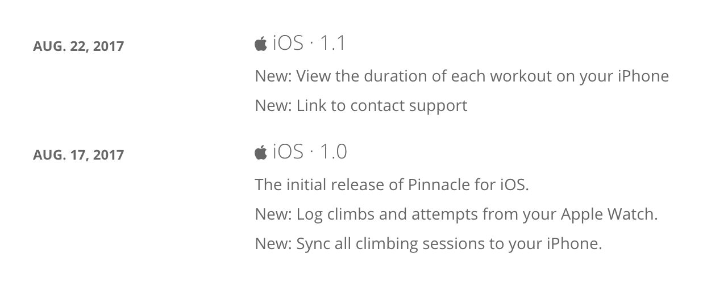
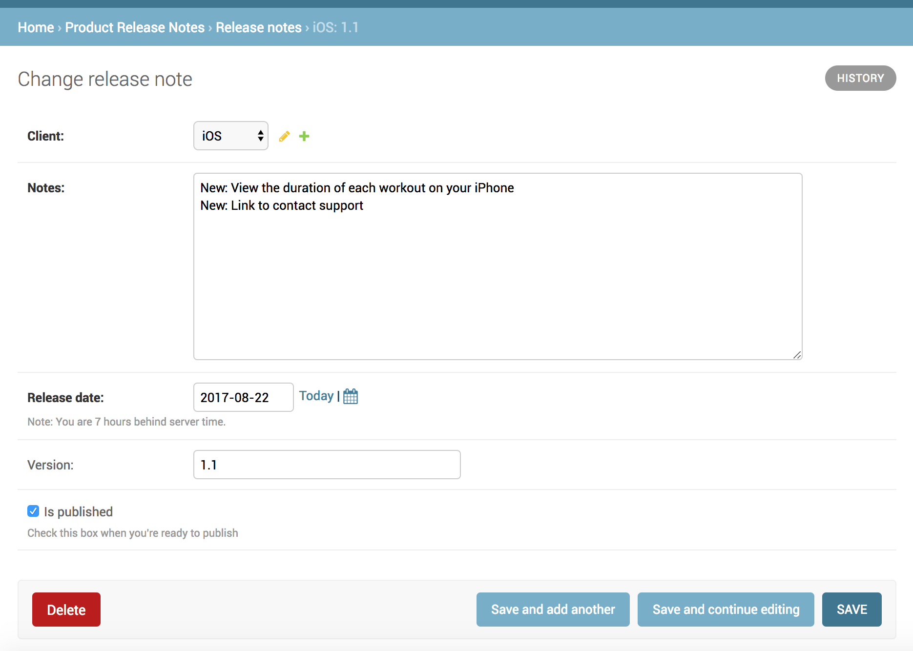

# product-release-notes

[](https://travis-ci.org/nickromano/product-release-notes)
[](https://coveralls.io/github/nickromano/product-release-notes?branch=master)
[](https://pypi.python.org/pypi/product-release-notes)


Add a changelog for your website that includes release notes for each of your clients.

* Support for multiple clients (iOS, Android, Web)
* RSS feed of changes
* Easily extend the style of the page
* Automatically pull release notes from iTunes
* Automatically pull release notes from Google Play

You can either install it as a package into your existing project, or deploy directly to Heroku.

[](https://heroku.com/deploy)



Edit releases using the Django Admin.



## Examples

* [Pinnacle Climb Log](https://pinnacleclimb.com/release-notes/)
* [Echo Responder](https://echoresponder.com/release-notes/)

## Installation

1) Install the python package

```
pip install product_release_notes
```

2) Add `product_release_notes` to `INSTALLED_APPS` in your `settings.py`.

3) Add a url to your `urls.py`.

```python
# project.urls.py
from django.conf.urls import url, include

urlpatterns = [
    url(r'^release-notes/', include('product_release_notes.urls')),
]
```

4) Run migrations to create the release notes tables.

```
./manage.py migrate
```

## Settings

Optional settings to customize the release notes page.

```python
RELEASE_NOTES_PAGE_DESCRIPTION = 'My product updates.'
RELEASE_NOTES_AUTO_PUBLISH = False
```

5) Optional - Create release note drafts when new versions are released to iTunes

Fill in the `itunes_url` field when creating a client.

Add a scheduled job to run at least daily to check for new versions in iTunes and Google Play

```
./manage.py check_app_stores
```

6) Optional - Customize the release notes page

Create a template `release_notes/base.html` to override the packages base template.

```html
<!DOCTYPE html>
<html>
<head>
	<title>Release Notes</title>

	
</head>
<body>




</body>
</html>
```
